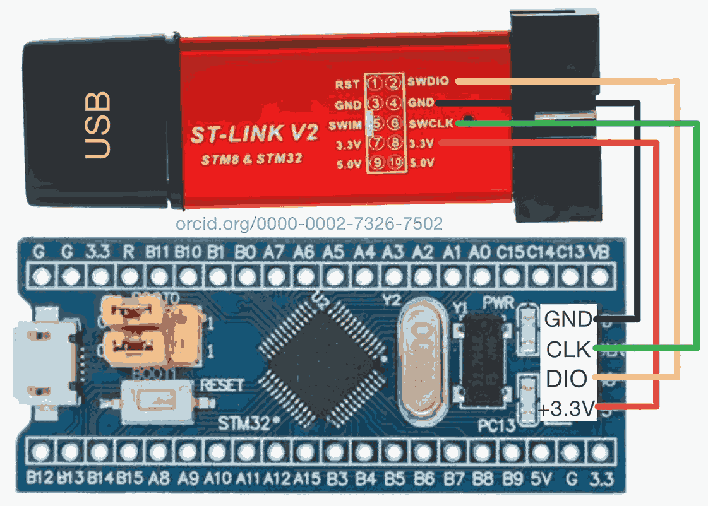
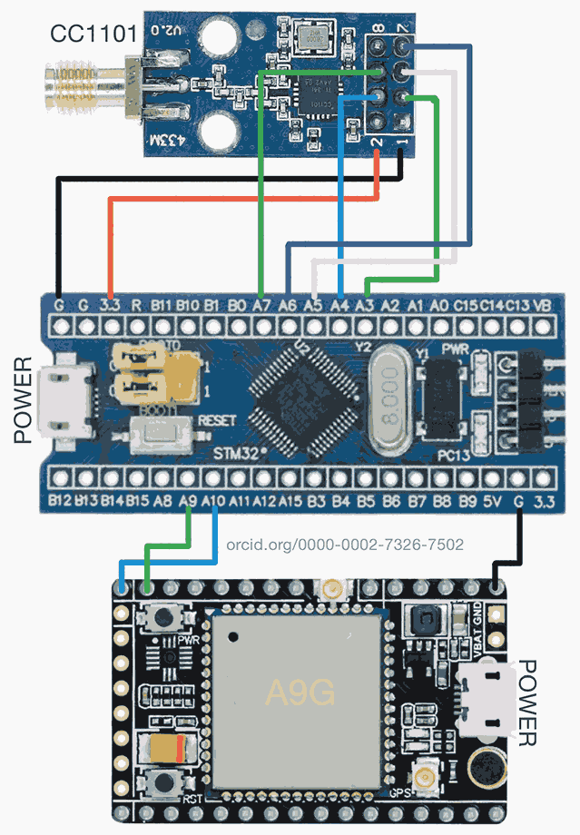
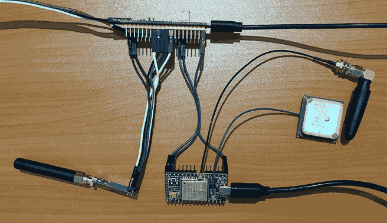
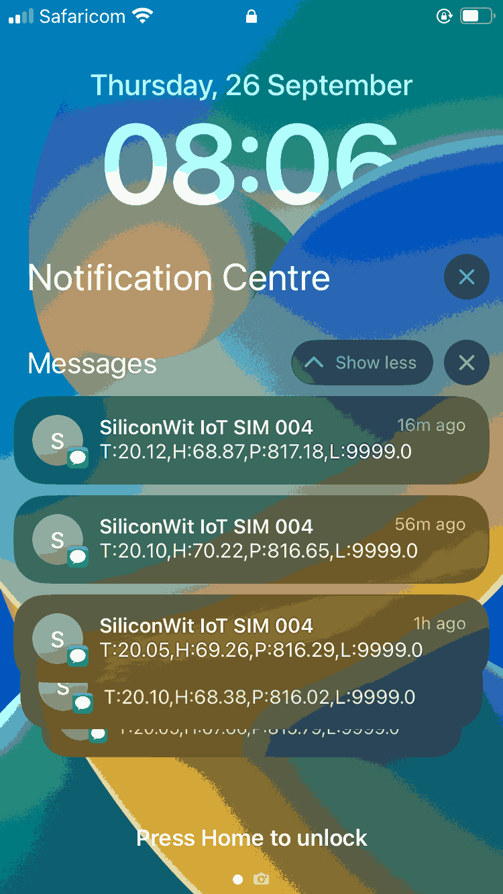
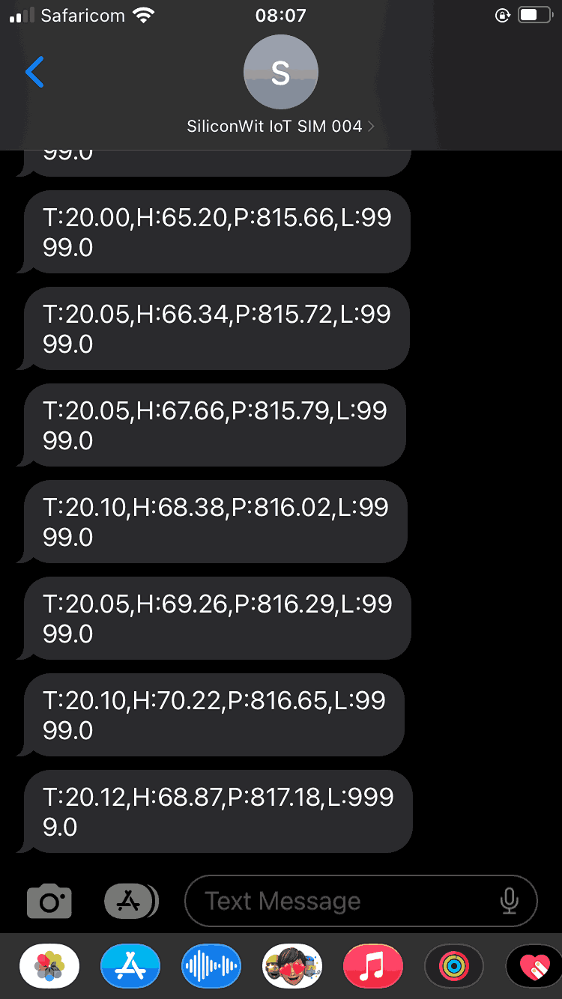

# Field Data Receiver Assembly Guide for Precision Irrigation

## Overview

This guide details the master receiver sensor sink node for remote agricultural monitoring. Our system utilizes an STM32 Blue Pill microcontroller, a CC1101 module for receiving data from multiple slave nodes, and an A9G module for sending SMS or MQTT messages from remote smallholder farm fields with limited internet connectivity.

## Components

1. STM32F103C8T6 "Blue Pill" development board
2. CC1101 433 MHz wireless RF transceiver module
3. A9G GSM/GPRS module
4. ST-LINK V2 programmer
5. Jumper wires
6. Micro USB cable (for power)

## Hardware Setup

### ST-LINK V2 and Blue Pill Connection

| ST-LINK V2 Pin | Blue Pill Pin | Function |
|----------------|---------------|----------|
| SWDIO          | DIO           | Data I/O |
| GND            | GND           | Ground   |
| SWCLK          | CLK           | Clock    |
| 3.3V           | +3.3V         | Power    |



### CC1101 and A9G to Blue Pill Connection



#### CC1101 to Blue Pill

| CC1101 Pin | Blue Pill Pin | Function |
|------------|---------------|----------|
| GND        | GND           | Ground   |
| VCC        | 3.3V          | Power    |
| GDO0       | PA3           | Digital Output 0 |
| CSN        | PA4           | SPI Chip Select |
| SCK        | PA5           | SPI Clock |
| MOSI       | PA7           | SPI Master Out Slave In |
| MISO       | PA6           | SPI Master In Slave Out |

#### A9G to Blue Pill

| A9G Pin | Blue Pill Pin | Function |
|---------|---------------|----------|
| TXD     | PA10          | UART RX  |
| RXD     | PA9           | UART TX  |
| GND     | GND           | Ground   |
| VCC     | Not Connected | Power (A9G powered separately) |

### Physical Setup Example



## Firmware

We developed the firmware using PlatformIO. Here's our `platformio.ini` configuration:

```ini
[env:bluepill_f103c8]
platform = ststm32
board = bluepill_f103c8
framework = arduino
upload_protocol = stlink
build_flags = 
    -D PIO_FRAMEWORK_ARDUINO_ENABLE_CDC
    -D USBCON
    -D USB_MANUFACTURER="Unknown"
    -D USB_PRODUCT="\"BLUEPILL_F103C8\""
    -D HAL_PCD_MODULE_ENABLED

; Library dependencies
lib_deps =
    mikem/RadioHead@^1.120
```

The main code (`main.cpp`) can be found in our [GitHub repository](https://github.com/SiliconWit/iot-irrigation-system/blob/27e2de728da9e7971b87d2ad2a175b2986a54aaa/field-design/platform-io/stm32_cc1101_receiver_a9g_sms/src/main.cpp). Key features include wireless data reception, GSM/GPRS connectivity, and periodic system resets for improved reliability.


Key features include:

- Initialization of CC1101 and A9G modules
- Receiving and parsing wireless data from sensor nodes
- Formatting and sending data via SMS or MQTT
- GPS location tracking
- Periodic system resets for improved reliability
- LED status indication for debugging

## Assembly Instructions

1. Connect the ST-LINK V2 to the Blue Pill following the connection table in the Hardware Setup section.
2. Upload the firmware to the Blue Pill using PlatformIO or your preferred IDE.
3. Disconnect the ST-LINK V2 after programming is complete.
4. Connect the CC1101 module to the Blue Pill according to the CC1101 to Blue Pill connection table.
5. Connect the A9G module to the Blue Pill as per the A9G to Blue Pill connection table.
6. Double-check all connections for correctness and security.
7. If using an external antenna for the CC1101 or A9G, ensure it's properly connected.

## Power Supply

For testing and initial setup, power the device using a micro USB cable connected to the Blue Pill's USB port.

For field deployment, we recommend using a rechargeable LiPo battery with appropriate voltage regulation. The system typically requires a 3.7V to 4.2V supply. Ensure the battery capacity is sufficient for your intended deployment duration, taking into account the power consumption of the Blue Pill, CC1101, and A9G module.

When using a battery:
1. Connect the battery to the Blue Pill's BAT pin through a protection circuit to prevent over-discharge.
2. Use a low-dropout (LDO) voltage regulator to provide a stable 3.3V supply to the CC1101 module.
3. Power the A9G module separately using its recommended power supply circuit, typically involving a step-up converter to provide the required voltage for GSM transmission.

Always ensure proper power management to optimize battery life and system reliability in remote deployments.


### SMS Output Examples

 

## Field Deployment Recommendations

1. Implement sleep modes to optimize power consumption, crucial for long-term deployment in remote areas.
2. Integrate solar charging capabilities to ensure uninterrupted operation and reduce maintenance needs.
3. Design a robust, weatherproof enclosure to protect the system from harsh environmental conditions typically found in agricultural settings.
4. Implement end-to-end data encryption to ensure the security and integrity of transmitted information.
5. Add over-the-air (OTA) firmware update functionality for remote maintenance and feature upgrades.
6. Integrate local data logging (e.g., SD card) as a backup measure in case of network failures.
7. Implement adaptive sampling rates to balance data accuracy with power consumption based on environmental conditions.

## Contact Information

For further information, support, or to discuss implementation, please contact: sam@siliconwit.com

For code updates and detailed documentation, visit our [GitHub repository](https://github.com/SiliconWit/iot-irrigation-system).