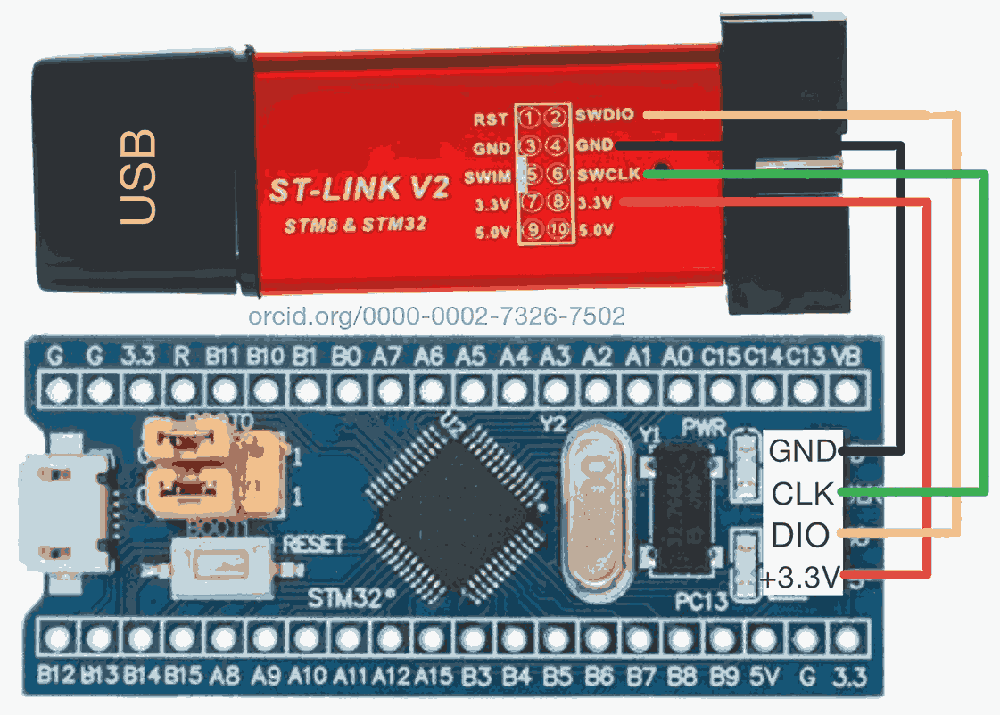
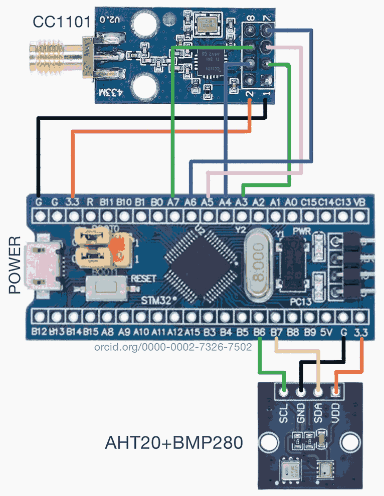
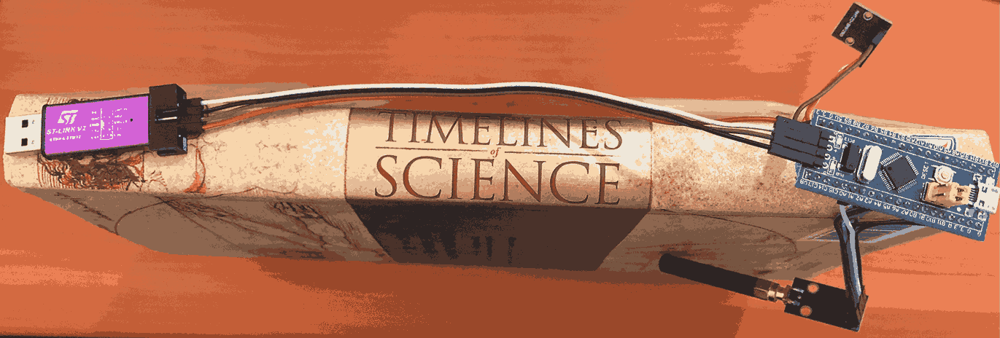
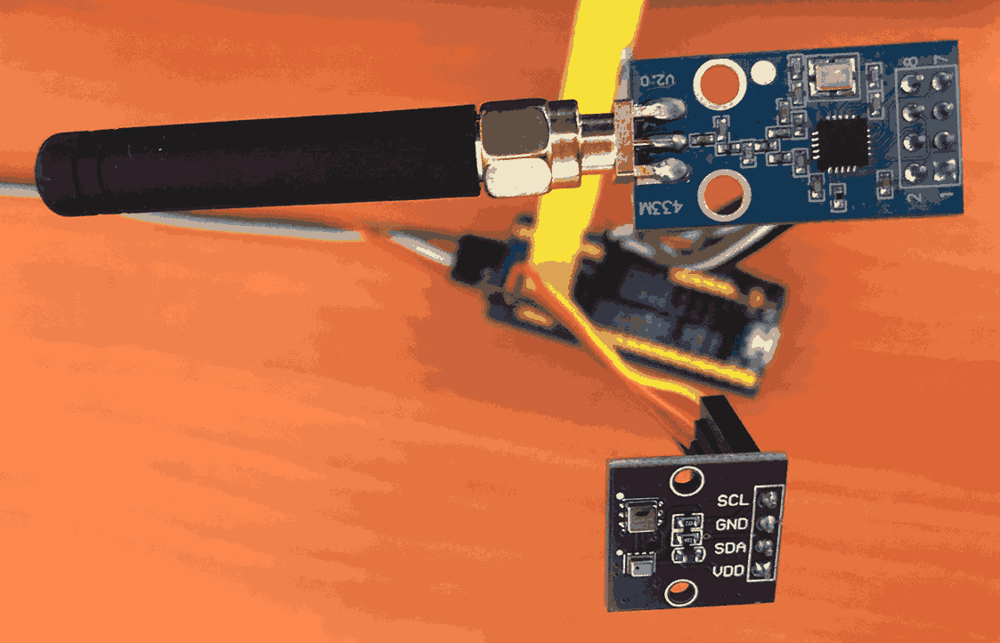

# Field Data Transmitter Assembly Guide for Precision Irrigation

## Overview

This guide outlines the assembly process for a wireless field data transmitter designed for our precision irrigation system. Using the STM32F103C8T6 "Blue Pill" Development Board and CC1101 Wireless RF Transceiver, this system collects and transmits environmental data in a distributed sensor network, enabling informed irrigation decisions.

## Components

1. STM32F103C8T6 "Blue Pill" development board
2. CC1101 433 MHz wireless RF transceiver module
3. AHT20+BMP280 combined temperature, humidity, and pressure sensor
4. ST-LINK V2 programmer
5. Jumper wires
6. Micro USB cable (for power)

## Hardware Setup

### ST-LINK V2 and Blue Pill Connection

| ST-LINK V2 Pin | Blue Pill Pin | Function |
|----------------|---------------|----------|
| SWDIO          | DIO           | Data I/O |
| GND            | GND           | Ground   |
| SWCLK          | CLK           | Clock    |
| 3.3V           | +3.3V         | Power    |



### CC1101 and AHT20+BMP280 to Blue Pill Connection



#### CC1101 to Blue Pill

| CC1101 Pin | Blue Pill Pin | Function |
|------------|---------------|----------|
| GND        | GND           | Ground   |
| VCC        | 3.3V          | Power    |
| GDO0       | PA3           | Digital Output 0 |
| CSN        | PA4           | SPI Chip Select |
| SCK        | PA5           | SPI Clock |
| MOSI       | PA7           | SPI Master Out Slave In |
| MISO       | PA6           | SPI Master In Slave Out |

#### AHT20+BMP280 to Blue Pill

| Sensor Pin | Blue Pill Pin | Function |
|------------|---------------|----------|
| VCC        | 3.3V          | Power    |
| GND        | GND           | Ground   |
| SDA        | PB7           | I2C Data |
| SCL        | PB6           | I2C Clock |

### Physical Setup Example




## Firmware

The firmware was developed using PlatformIO. Here's the `platformio.ini` configuration:

```ini
[env:bluepill_f103c8]
platform = ststm32
board = bluepill_f103c8
framework = arduino
lib_deps = 
    mikem/RadioHead@^1.120
    adafruit/Adafruit AHTX0@^2.0.3
    adafruit/Adafruit BMP280 Library@^2.6.6
    adafruit/Adafruit Unified Sensor@^1.1.9
```

The main code (`main.cpp`) can be found [here](https://github.com/SiliconWit/iot-irrigation-system/blob/c31cb5c0f6f231f0286bb7a33b6ac076ce1f20d0/field-design/platform-io/stm32_cc1101_transmit/src/main.cpp). Key features include:

- Initialization of CC1101, AHT20, and BMP280 sensors
- Reading sensor data (temperature, humidity, pressure)
- Formatting and transmitting data wirelessly
- LED status indication for debugging

## Assembly Instructions

1. Connect the ST-LINK V2 to the Blue Pill as per the connection table.
2. Upload the firmware to the Blue Pill using PlatformIO or your preferred IDE.
3. Disconnect the ST-LINK V2 after programming.
4. Connect the CC1101 module and AHT20+BMP280 sensor to the Blue Pill following the connection tables.
5. Verify all connections for correctness and security.

## Power Supply

For testing, power the device using a micro USB cable connected to the Blue Pill's USB port. For field deployment, use a rechargeable LiPo battery with appropriate voltage regulation.

## Field Deployment Recommendations

To optimize this system for large-scale precision irrigation, consider the following recommendations:

1. **Sensor Expansion**: Incorporate additional sensors such as soil moisture sensors for more comprehensive data collection.

2. **Network Topology**: Implement a mesh network topology to improve range and reliability across large fields.

3. **Power Management**: Develop advanced power management techniques, including sleep modes and potentially solar charging, to extend battery life.

4. **Weatherproofing**: Design robust, weatherproof enclosures suitable for long-term field exposure.

5. **Data Security**: Implement encryption and authentication measures to secure wireless communication.

6. **Scalability**: Develop a robust addressing system and network management protocol to handle numerous nodes.

7. **System Integration**: Create interfaces to integrate the sensor network with existing irrigation control systems and farm management software.

8. **Remote Management**: Implement over-the-air (OTA) firmware updates and remote configuration capabilities.

9. **Regulatory Compliance**: Ensure compliance with local regulations regarding radio frequency usage and environmental monitoring.

## Troubleshooting

- If the LED doesn't blink as expected, check power connections and verify firmware upload.
- For communication issues, ensure all SPI and I2C connections are secure and correctly wired.
- If sensor readings seem incorrect, verify sensor connections and check for physical obstructions or environmental factors that might affect readings.

This field data transmitter design demonstrates our approach to precision irrigation. For further information, support, or to discuss implementation, please contact: sam@siliconwit.com or visit our [GitHub repository](https://github.com/SiliconWit/iot-irrigation-system).